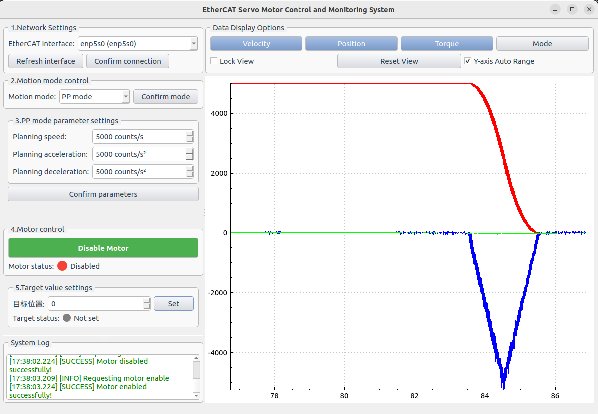

# SOEM EtherCAT Master Demo (eRob)

***This is an open-source demo related to the eRob product, provided solely for reference by developers. Please note that issues within the open-source project are independent of the quality of eRob products. Users are advised to exercise caution while using the demo. We are not responsible for any damage caused by improper operations. For any project errors, please raise a query in the Issues section. Collaboration and forks to resolve open-source project issues are welcome.***

## 1. Environment Setup

### Prerequisites
- **Operating System:** Linux (recommended: Ubuntu 22.04)
- **Compiler:** GCC (g++), CMake (>=3.10)
- **Qt:** Qt5 (for GUI)
- **Git**
- **Make**

### Install Dependencies (Ubuntu Example)
```bash
sudo apt update
sudo apt install -y build-essential cmake qtbase5-dev qt5-qmake git
```

> **Tip:** For real-time EtherCAT operation, it is recommended to use a real-time Linux kernel and isolate CPU cores for EtherCAT tasks.

## 2. Build/Compile

### Clone the Repository
```bash
git clone https://github.com/ZeroErrControl/SOEM_GUI.git
cd eRob_SOEM_GUI
cd build 
cmake ..
make -j8
cd .. 
cd bin/
sudo ./ethercat_monitor
```

## 3. Usage

### GUI Interface

The application provides a comprehensive GUI for EtherCAT master control and monitoring:



**Main Features:**
- **Network Settings:** Configure EtherCAT network interface
- **Motion Control:** Real-time motor control in various modes
- **Data Monitoring:** Live position, velocity, and torque data
- **Status Display:** Real-time EtherCAT slave status
- **Logging:** Comprehensive logging and error reporting

### Demo Modes

The application supports multiple operation modes for testing and demonstration:

1. **Position Profile (PP) Mode:** Position-based motion control
2. **Velocity Profile (PV) Mode:** Velocity-based motion control  
3. **Torque Profile (PT) Mode:** Torque-based motion control
4. **Cyclic Synchronous Position (CSP) Mode:** Advanced position control with motion planning
5. **Cyclic Synchronous Velocity (CSV) Mode:** Advanced velocity control
6. **Cyclic Synchronous Torque (CST) Mode:** Advanced torque control

### Basic Usage Example

```bash
# Start the application
sudo ./ethercat_monitor

# Select network interface in GUI
# Enable motor control
# Choose operation mode
# Set target values
# Monitor real-time data
```

## 4. Project Structure

```
SOEM_GUI/
├── src/                    # Source code
│   ├── main.cpp           # Main application entry
│   ├── ethercat/          # EtherCAT communication
│   ├── qt_ui/             # GUI components
│   └── algorithms/        # Motion planning algorithms
├── include/               # Header files
├── doc/                   # Documentation and images
├── third_party/           # Third-party libraries (SOEM, QCustomPlot)
└── bin/                   # Compiled binaries
```

## 5. Troubleshooting

### Common Issues

**Step 4 DC Configuration Hangs:**
- Check network interface selection
- Verify hardware connections
- Ensure proper permissions (run with sudo)
- Check slave device status

**Build Errors:**
- Ensure all dependencies are installed
- Check Qt5 installation
- Verify CMake version (>=3.10)

**Runtime Errors:**
- Run with sudo for EtherCAT access
- Check network interface configuration
- Verify slave device compatibility

### Debug Tips

1. **Enable Verbose Logging:** Check console output for detailed error messages
2. **Network Interface:** Ensure correct network interface is selected
3. **Hardware Check:** Verify EtherCAT slave connections and power
4. **Permissions:** Run with appropriate permissions for network access

## 6. FAQ

**Q: Why does the application need sudo?**
A: EtherCAT requires direct network interface access, which typically requires root privileges.

**Q: Which network interface should I select?**
A: Choose the physical network interface connected to your EtherCAT network, not loopback or wireless interfaces.

## 7. Contributing

We welcome contributions! Please:

1. Fork the repository
2. Create a feature branch
3. Make your changes
4. Submit a pull request

For bug reports, please use the Issues section with detailed information about your environment and the problem encountered.

## 8. Community & Support

- **Issues:** [GitHub Issues](https://github.com/ZeroErrControl/SOEM_GUI/issues)
- **Documentation:** Check the `doc/` directory for detailed documentation
- **SOEM Library:** [SOEM Documentation](https://openethercatsociety.github.io/soem/)

---

**Note:** This is a demonstration project. For production use, ensure proper testing and validation of your specific hardware configuration.